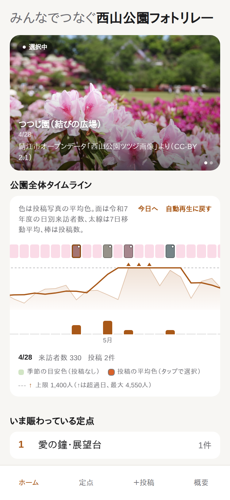
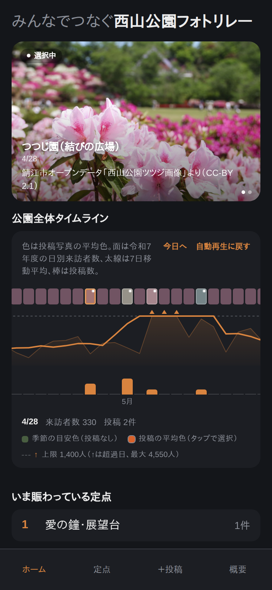
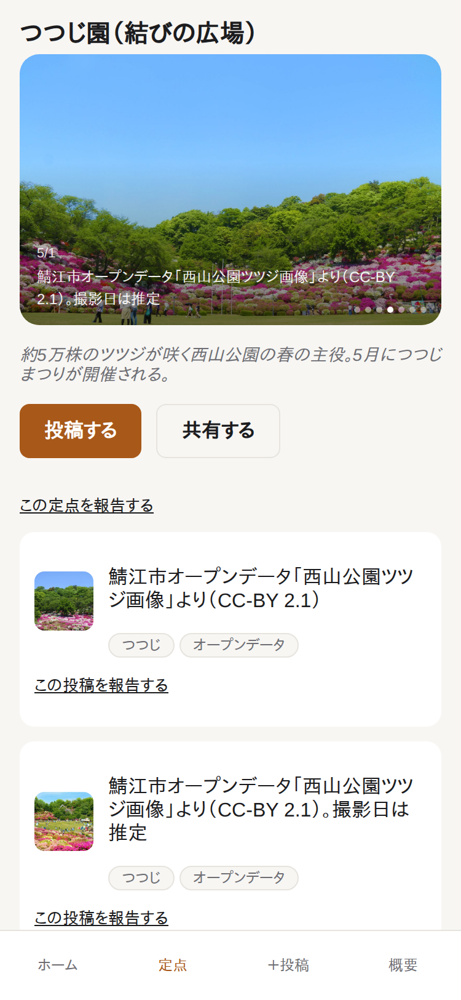
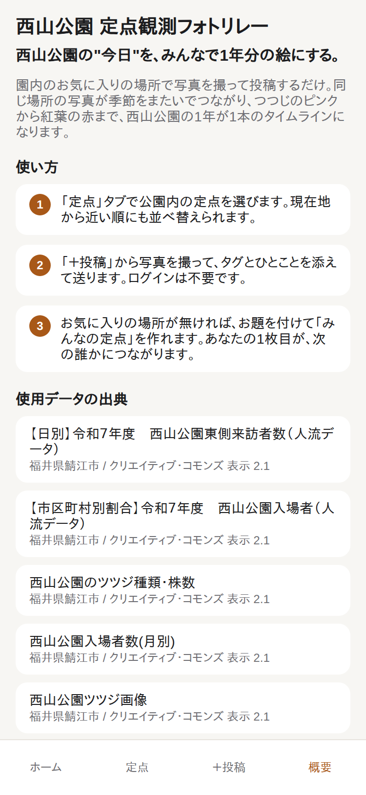

# 西山公園フォトリレー

> 西山公園の"今日"を、みんなで1年分の絵にする。

福井県鯖江市「オープンデータ活用アプリコンテスト2026」応募作品です。

**公開URL:** https://nishiyama-photo-relay.vercel.app

**ソースコード:** https://github.com/kowa-sasaki/nishiyama-photo-relay

| ホーム（ライト） | ホーム（ダーク） |
|---|---|
|  |  |

| 定点詳細 | 概要 |
|---|---|
|  |  |

園内の決まったビューポイント（定点）で写真を撮って投稿すると、季節をまたぐ時系列ギャラリーが育っていきます。市の人流オープンデータ（日別来訪者数）を同じ時間軸に重ねることで、「賑わい」と「景色」が1本のタイムラインで読めます。

## コンセプト

定点は運営側の固定リストにせず、**公式定点（5箇所）とユーザーが「お題」付きで立ち上げる「みんなの定点」**の二層構造にしています。

- **公式定点**：市のCC-BY画像でシードした背骨。デモが空にならないための土台。
- **みんなの定点**：作成には1枚目の写真が必須で、「ランニング途中によってみた」のような行動・文脈込みの記録が起点になります。地元の日常の使い方こそ、観光地化を目指す公園にとって本物の魅力だと考えています。

ここから、「投稿が途切れずどれだけ長くつながっているか」を定点ごとに数える**継承日数**（ホーム画面のランキングに表示）が生まれます。直近14日以内の投稿が途切れず連なっている限り連鎖は継続し、その連鎖が始まった日からの経過日数がスコアになります。既存データの消費だけでなく、新しいデータを生み出す仕組みそのものが本作のデータ活用度の核です。

投稿写真の平均色を時間軸に重ねる「色のリボン」も、つつじのピンク → 新緑 → 紅葉 → 雪の白という西山公園の季節変化をそのまま可視化するデータビジュアルです。

### 予選時点のデータ量について

予選審査（2026年10月中旬）の時点では実利用期間が数週間しかなく、投稿の大半は市のオープンデータ画像14枚によるシードです。予選で見せられるのは「仕組み」であり、決勝（2026年11月28日）までの約2ヶ月でユーザー投稿が積み上がっていく設計です。実績を誇張しないため、この時間差を明記します。

### モデレーションについて

通報導線と `is_hidden` による非表示化は実装済みですが、確認は開発者本人が Supabase ダッシュボードから手動で行う運用です。本番運用（市への引き渡し等）では、自動フィルタや複数人での確認体制の実装が必要です。

## 主な機能

- 定点別・公園全体の時系列タイムライン（投稿 × 人流データの重畳表示）
- 写真投稿フロー（撮る → タグ・ひとこと → 送る）。投稿は位置情報の判定で西山公園の中に限り、公園の外では保存されないデモ投稿を試せる
- ユーザーによる新規定点の作成（お題・GPS・1枚目の写真が必須）
- 継承日数の算出・表示（「みんなの定点」のうち、直近14日以内の投稿で途切れず連鎖している期間の長さ上位3件をランキング表示）
- 人気スポットランキング（直近30日の投稿数）
- 定点一覧ページでの並び替え（人気 / 継続中）
- 通報導線（定点・投稿の双方に対応。運営がSupabaseダッシュボードから内容を確認し非表示化する運用）
- Web Share APIによるSNS共有（専用ハッシュタグ `#西山公園定点観測` 付き）
- 定点一覧の「近い順」並び替え（位置情報はオプトイン）
- 定点詳細のタイムラプス風ヒーロー写真と拡大表示（ライトボックス）
- OGP対応（SNSに貼ると色のリボン入りのカードが展開）

## 技術構成

```
tools/  … Python（ローカル実行、出力をリポジトリにコミット）
  pandas + openpyxl : CKANのXLS/XLSX/CSVをビルド時に静的JSON化
  Pillow            : シード画像の平均色算出

app/    … Vite + React + TypeScript（静的ビルド）
  public/data/*.json（tools/ の出力。実行時に外部APIを叩かない）

Supabase（Postgres / Storage / 匿名認証）… ユーザー投稿のみが動的
```

人流データ等のオープンデータは**ビルド時に静的JSON化**してリポジトリにコミットしています。実行時に外部APIを叩かないため、審査当日にネットワーク起因で壊れません。動的なのはSupabase経由のユーザー投稿・定点作成・通報のみです。

## 使用データ・出典

鯖江市のCKANオープンデータカタログ（組織 `jp-fukui-sabae`、[CKAN API](https://ckan.odp.jig.jp/api/3/action/package_search?fq=organization:jp-fukui-sabae)）から取得しています。ライセンスはすべて **CC-BY 2.1（表示）** です。

| データセット | 形式 | 用途 | 出典 |
|---|---|---|---|
| 【日別】令和７年度 西山公園東側来訪者数（人流データ） | CSV | 公園全体タイムラインへの人流折れ線の重畳 | [CKAN](https://ckan.odp.jig.jp/dataset/5bb6a5ed-2529-4fb6-88e9-ff78c1badcd1) |
| 【市区町村別割合】西山公園入場者（人流データ） | CSV | `app/public/data/visitor_ratio_municipality.json` に変換済み（現行UIでは未表示。決勝までに「どこから来ているか」の可視化に使う予定） | [CKAN](https://ckan.odp.jig.jp/dataset/4ab39dd1-d25b-4948-b3c3-967b9eaea480) |
| 西山公園のツツジ種類・株数 | XLS | 定点スポットの根拠付け | [CKAN](https://ckan.odp.jig.jp/dataset/a78580f3-b6c9-4495-8734-ef7c2dfbbbfe) |
| 西山公園入場者数(月別) | XLS | `app/public/data/visitors_monthly.json` に変換済み（現行UIでは未表示） | [CKAN](https://ckan.odp.jig.jp/dataset/64081a92-440b-41f4-bc64-043996228588) |
| 西山公園ツツジ画像（7枚） | JPEG | 公式定点「つつじ園（結びの広場）」のシード投稿7枚、OGP画像（og.jpg）の背景 | [CKAN](https://ckan.odp.jig.jp/dataset/5485cc00-e0ff-4d75-b620-9402ed08a823) |
| 西山公園の紅葉画像（7枚） | JPEG | 公式定点「上段の庭（もみじ）」のシード投稿7枚 | [CKAN](https://ckan.odp.jig.jp/dataset/02c6e2d3-91b7-409e-b2af-0883d90cd842) |

出典元：福井県鯖江市（クリエイティブ・コモンズ 表示 2.1 / [CC-BY 2.1 JP](https://creativecommons.org/licenses/by/2.1/jp/)）

上記の最新版は、アプリ内の「概要」タブでも `tools/build_credits.py` がビルド時に出力する `app/public/data/credits.json` から自動表示しています。

定点の緯度経度は公園内スポットの座標データが公開されていないため、独自にGeoJSON相当の形で定義しています。

## セットアップ

### アプリ（app/）

```bash
cd app
npm install
cp .env.local.example .env.local  # なければ VITE_SUPABASE_URL / VITE_SUPABASE_ANON_KEY を記載して作成
npm run dev
```

Supabase側は `supabase/migrations/` のSQLを適用し、匿名認証（Anonymous Sign-Ins）を有効化してください。

```bash
npm run build   # 型チェック + 本番ビルド
npm test        # Vitest
```

### データ変換ツール（tools/）

```bash
cd tools
python -m venv .venv && source .venv/bin/activate
pip install -r requirements.txt
python run_all.py   # CKANから取得したXLS/XLSX/CSVを app/public/data/*.json に変換
```

公式定点5箇所と市のCC-BY画像14枚を Supabase に投入するには、service_role キーを環境変数で渡して実行します（冪等。`--dry-run` で通信せずに内容を確認できます）。

```bash
cd tools
export SUPABASE_URL=https://<project>.supabase.co
export SUPABASE_SERVICE_ROLE_KEY=<service_role>   # 絶対にコミットしない
python seed_supabase.py --dry-run
python seed_supabase.py
```

OGP画像 app/public/og.jpg は tools/build_og_image.py で生成しています（tools/raw/seed_images/ の市のCC-BY画像から、シード14枚の平均色リボンを合成）。素材取得後に cd tools && python build_og_image.py で再生成できます。

## ライセンス

MIT License（[LICENSE](LICENSE)）。使用データセットのライセンス（CC-BY 2.1）は上記出典の通りで、コード本体のMITライセンスとは別に、各データセットのクレジット表記が必要です。
